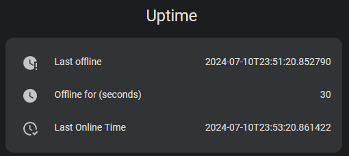

# Uptime Tracker

## Overview

The Uptime Tracker custom component for Home Assistant provides sensors that monitor the duration of server offline periods. It includes two sensors:

1. `Last Offline`: Shows the exact date and time when the server went offline.
2. `Last Offline Duration`: Displays the duration in seconds since the server last went offline.



---

## Installation

1. Download the Component:
   - Clone or download the repository.

2. Install in Home Assistant
   - Copy the `uptime_tracker` directory into the `custom_components` directory in your Home Assistant config directory.
   ```bash
    /config/
    ├── configuration.yaml
    └── custom_components/
      └── uptime_tracker/
        ├── __init__.py
        ├── manifest.json
        └── sensor.py
   ```
3. Restart Home Assistant
   1. Navigate to the `Developer Tools`
   2. Quick restart Home Assistant

4. Configure in `configuration.yaml`:
   - Add the following lines to your `configuration.yaml` file:
   ```yaml
   sensor:
      - platform: uptime_tracker
   ```

5. Restart Home Assistant
    1. Navigate to the `Developer Tools`
    2. Quick restart Home Assistant

---

## How It Works

1. The component continuously updates the last online time whenever the server is operational.
2. Upon the server returning online, the component calculates the duration of the outage by subtracting the last online time from the current time.

---

## Example Scenario
**Scenario**: The server goes offline and returns online after 60 seconds.

- Last Offline: Shows "10 July 2024 at 22:53:05", the exact date and time when the server went offline.
- Last Offline Duration: Displays "60 seconds", indicating the duration of the recent outage.
